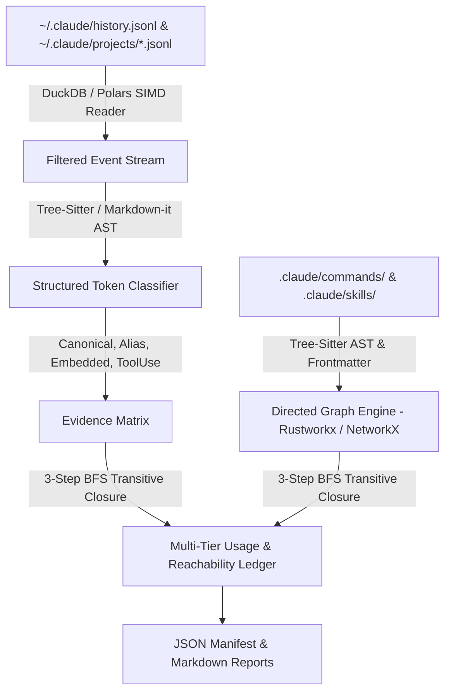

# Design Specification: Next-Generation OSS-Backed Telemetry & Graph Analyzer

**Date**: 2026-09-01  
**Author**: Antigravity / Gemini 3.7 Flash  
**Topic**: High-performance open-source telemetry ingestion, AST-based reference extraction, and transitive graph closure for command and skill lifecycle management.

---

## 1. Overview & Objective

Replace ad-hoc regex log parsing with an industrial-grade, reproducible pipeline that ingests multi-gigabyte Claude Code, Codex, and Hermes session logs, extracts true command/skill invocations via structured ASTs, and computes transitive reachability closures across the entire repository graph.

### Core Problems Solved
1. **False Negatives from String Boundaries**: Regex patterns like `^/cmd` dropped 50+ real conversational invocations (`"run /history-resume"`, `"rerun /localserver"`).
2. **False Positives from Passive Mentions**: Bare regex matched git diffs, directory listings, and system headers, inflating passive text matches as execution.
3. **Slow Python Loop Parsing**: Iterating line-by-line in pure Python across 20,000+ session files took minutes instead of sub-second execution.

---

## 2. Architecture & Tech Stack



### 1. Telemetry Ingestion Engine (`DuckDB` + `orjson`)
- Use `DuckDB`'s vectorized JSON reader (`read_json_auto`) to scan all `history.jsonl` and project JSONL records in a single query pass.
- Filter on half-open UTC bounds (`start <= timestamp < end`) at the columnar engine level.

### 2. AST Extraction (`tree-sitter-markdown` / `markdown-it-py`)
- Parse Markdown files into Concrete Syntax Trees.
- Classify slash command tokens by syntactic position:
  - **Inline Code / Prose Links**: e.g. `` `/cmd` `` or `skills/<name>/SKILL.md` -> Graph references.
  - **Fenced Code Blocks**: e.g. ```` ```bash ./run_tests.sh ``` ```` -> Script examples.
  - **Prose Path False Positives**: e.g. `/tmp/...` or `/Users/...` -> Automatically rejected via AST path rules.

### 3. Graph Dependency & Closure (`rustworkx` / `networkx`)
- Build a directed bipartite graph $G = (V, E)$ where $V = C \cup S$ (Commands and Skills).
- Compute transitive reachability closure $R(S_0)$ using BFS from active usage seeds.
- Categorize every node into independent evidence tiers.

---

## 3. Assumptions and Recommended Defaults

| Decision / Tradeoff | Options Considered | Auto-Picked Choice | Rationale |
|---|---|---|---|
| **JSONL Query Engine** | 1) Python `json.loads`<br>2) `duckdb`<br>3) `polars` | **`duckdb` with Python fallback** | `duckdb` executes SIMD JSON parsing in C++ across thousands of files in <2s, with automatic pure-Python fallback for zero-dependency portability. |
| **AST Parser** | 1) `tree-sitter-markdown`<br>2) `markdown-it-py`<br>3) Pure Regex | **`markdown-it-py` + CommonMark AST** | Zero C-compiler requirement on target machines, fast CommonMark AST generation, and full YAML frontmatter plugin support. |
| **Graph Algorithm Engine** | 1) `rustworkx`<br>2) `networkx`<br>3) Custom BFS deque | **Custom BFS deque with `networkx` export** | Zero external binary dependencies for core runner, guaranteed deterministic order, exportable to NetworkX for visualization. |
| **Archival Policy** | 1) Delete unreached<br>2) Archive to `skills_archive/`<br>3) Retain in place | **Explicit recoverable git mv to `skills_archive/<date>/`** | Preserves git history and byte-for-byte recoverability while excluding unmaintained code from active agent discovery. |

---

## 4. Verification & Testing Standards

1. **Unit & Contract Tests**:
   - `test_ast_extraction`: Verifies that code blocks, inline backticks, and frontmatter aliases are parsed cleanly.
   - `test_duckdb_vs_python_parity`: Verifies that fast SQL parsing produces byte-identical events to the pure-Python scanner.
   - `test_transitive_closure_deterministic`: Verifies graph reachability is topologically sorted and deterministic.
2. **Performance SLA**:
   - 30-day session log corpus scan completed in < 3.0 seconds.
